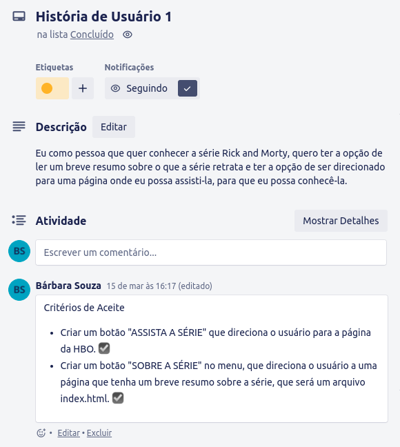
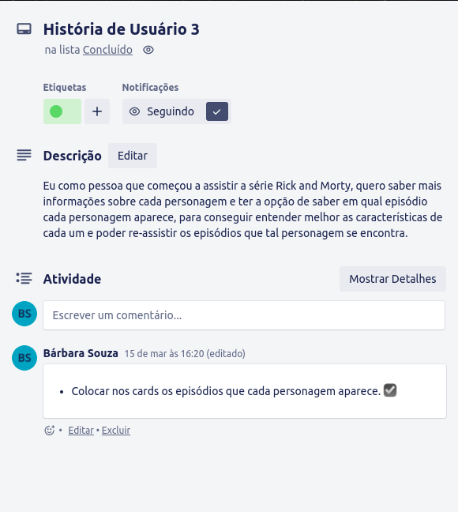
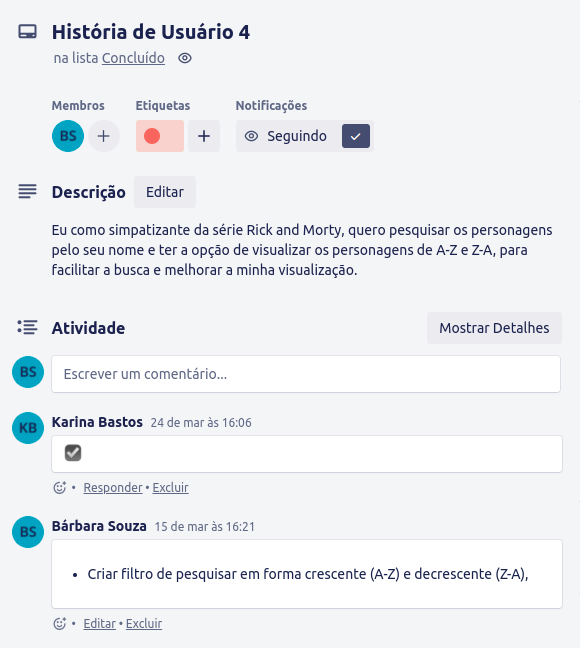
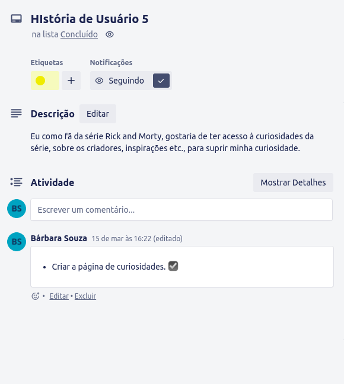
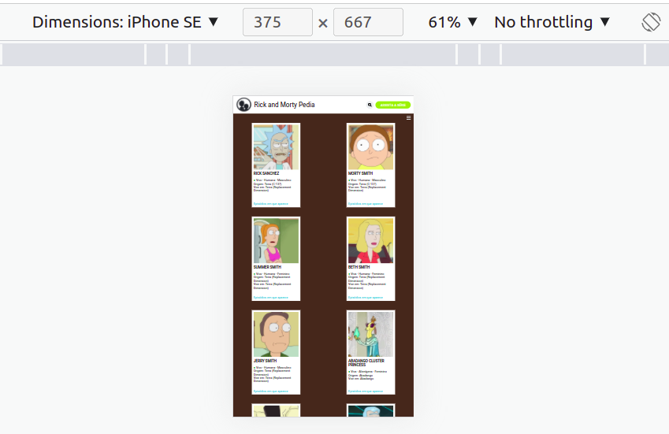
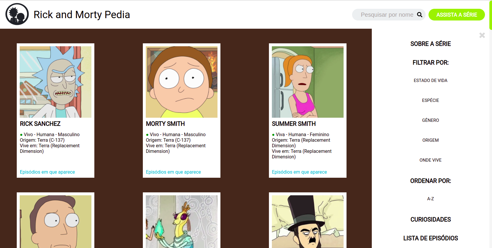
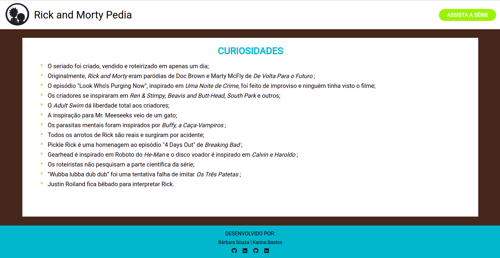
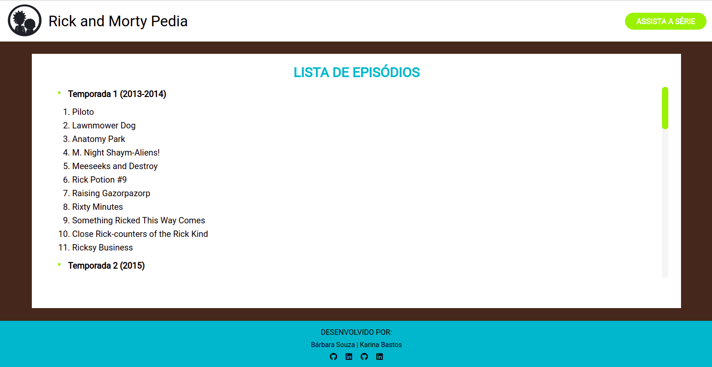
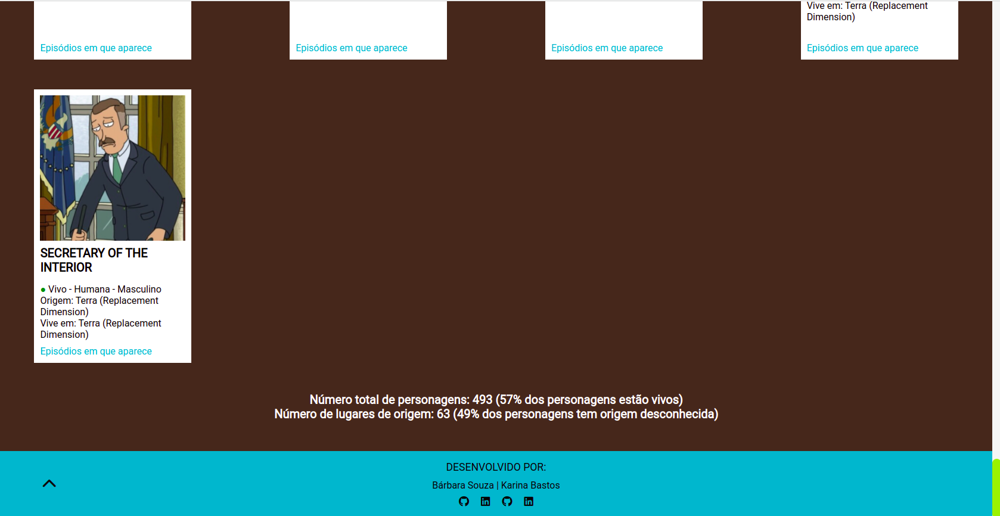
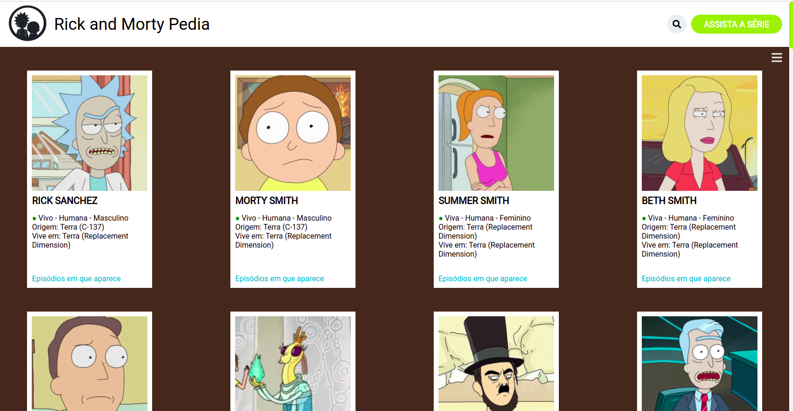

# Rick and Morty Pedia

## Índice 
* [1. Descrição do Projeto](#descrição-do-projeto) 
* [2. Pesquisa de Usuários](#pesquisa-de-usuários)
* [3. Histórias de Usuário](#histórias-de-usuário)
* [4. Prototipagem](#protótipos-do-projeto)
* * [4.1  Protótipo de Baixa Fidelidade](#protótipo-de-baixa-fidelidade)
* * [4.2 Protótipo de Alta Fidelidade](#protótipo-de-alta-fidelidade)
* [5. Interface](#interface) 
* * [5.1 Página Inicial](#página-inicial)
* * [5.2 Páginas Extras](#páginas-extras)
* * [5.3 Cálculo Agregado](#cálculo-agregado)
* * [5.4 Responsividade](#responsividade)
*  [6. Acesso ao Projeto](#acesso-ao-projeto) 
* [7. Tecnologias utilizadas](#tecnologias-utilizadas) 
* [8. Pessoas Desenvolvedoras do Projeto](#pessoas-desenvolvedoras) 
*  [9. Checklist de objetivos alcançados](#objetivos-alcançados)

***
## 1. Descrição do projeto 
O projeto **"**Rick and Morty Pedia"**** foi desenvolvido para o Bootcamp da [Laboratória](https://www.laboratoria.la/br), com a finalidade de criar uma interface web interativa e responsiva, que permitisse o usuário visualizar um conjunto de dados e informações de um determinado tema. 
 
 O tema escolhido foi a série de televisão *Rick and Morty* e o objetivo é permitir o usuário acessar informações importantes da série, filtrar e ordenar dados de forma visual e compreensível.

## 2. Pesquisa de Usuários
Foi realizada uma pesquisa com supostos usuários, buscando entender as necessidades e preferências do público e, assim, melhorar a experiência do usuário.

Inicialmente, definimos nosso público alvo para a realização da pesquisa: **Fãs, simpatizantes e pessoas que ainda não conhecem a série.**

A seguir, foram-lhes enviado via WhatsApp a ideia inicial do projeto e um questionário elaborado por nós, contendo as seguintes perguntas:

 - O que te levaria a acessar essa página web?
 - Quais informações mais importantes você gostaria de visualizar? 
 - Como você gostaria que fosse sua experiência?
 - O que você acharia interessante conter na interface?
 - Quais recursos seriam úteis para otimizá-la?

## 3. Histórias de Usuário

Baseado no resultado do processo de pesquisa, criamos nossas **Histórias de Usuário** no [Trello](https://www.trello.com/). Todas elas foram executadas no projeto. 

### 3.1 História de Usuário 1

### 3.2 História de Usuário 2

### 3.3 História de Usuário 3

### 3.4 História de Usuário 4

### 3.5 História de Usuário 5

### 3.6  História de Usuário 6

***
## 4.  Prototipagem

Primeiro, criamos o Protótipo de Baixa Fidelidade na plataforma [Miro](https://miro.com/) onde depositamos e testamos nossas ideias inicias de design para o layout. Após as ideias terem sido testadas e refinadas, desenvolvemos o Protótipo de Alta Fidelidade na plataforma [Figma](www.figma.com), para avaliar a usabilidade e a aparência final do projeto antes de implementá-la, levando em consideração nossa pesquisa e histórias de usuário. 

### 4.1 Protótipo de Baixa Fidelidade

### 4.2 Protótipo de Alta Fidelidade

## 5. Interface 

Com base na nossa pesquisa, criamos uma interface intuitiva e fácil de usar, para que o usuário possa realizar as ações desejadas de forma clara e simples, sendo visualmente agradável e bem organizada. 

### 5.1 Página Inicial
Na página inicial, inserimos uma barra de pesquisa onde o usuário pode pesquisar os personagens da série pelo seu nome, um botão que direciona o usuário ao site de Streaming que exibe a série, cards com imagem e informações mais relevantes e um menu onde o usuário pode interagir de forma eficaz, filtrando dados como "Estado de Vida", "Gênero", "Espécie", "Origem" e "Onde vive" ordenando de "A-Z" ou "Z-A" e tendo acesso às informações sobre o tema.

### 5.2 Páginas Extras
Adicionamos opções no menu onde o usuário pode ter acesso às páginas extras que contêm mais informações, como "Sobre a série" em que usuário pode ler um breve resumo sobre a mesma e motivando-o a assisti-la, "Lista de episódios" onde se encontram todos os episódios da série com seus respectivos títulos, dividido por temporadas com seus anos de lançamentos e por fim, a página  "Curiosidades", onde o usuário tem acesso às curiosidades sobre a série.

### 5.3 Cálculo Agregado
Na parte inferior da página inicial, incluímos informações importantes e cálculos agregados de porcentagem, que calculam o percentual da quantidade de Personagens Vivos e Personagens de Origem Desconhecida em relação ao Número total de personagens e o Número total de lugares de origem. 

### 5.4 Responsividade
Criamos uma interface responsiva que se adapta a diferentes tamanhos de tela, como smartphones, tablets e computadores em geral. 

## 6. Acesso ao Projeto
Você pode acessar o projeto clicando [aqui](https://souzabarbara.github.io/SAP009-data-lovers).

## 7. Tecnologias utilizadas

 - JavaScript
 - HTML
 - CSS
 - Miro
 - Figma
 - Trello
 - GIT
 - Jest
 - ESlint
 - VS Code

## 8. Pessoas Desenvolvedoras do Projeto

 - [Bárbara Souza](https://www.linkedin.com/in/barbarasouzasantos/)
 - Karina Bastos

## 9. Checklist de objetivos alcançados
-   [x] Usar VanillaJS.
-   [x] Passa pelo linter (npm run pretest)
-   [x] Passa pelos testes (npm test)
-   [x] Inclui uma definição de produto clara e informativa no README.md.
-   [x] Inclui histórias de usuário no README.md.
-   [x] Inclui rascunho da solução (protótipo de alta fidelidade) no README.md.
-   [x] UI: Permite ordenar dados por um ou mais campos (asc e desc).
-   [x] UI: Permite filtrar dados com base em uma condição.
-   [x] UI: É responsivo.